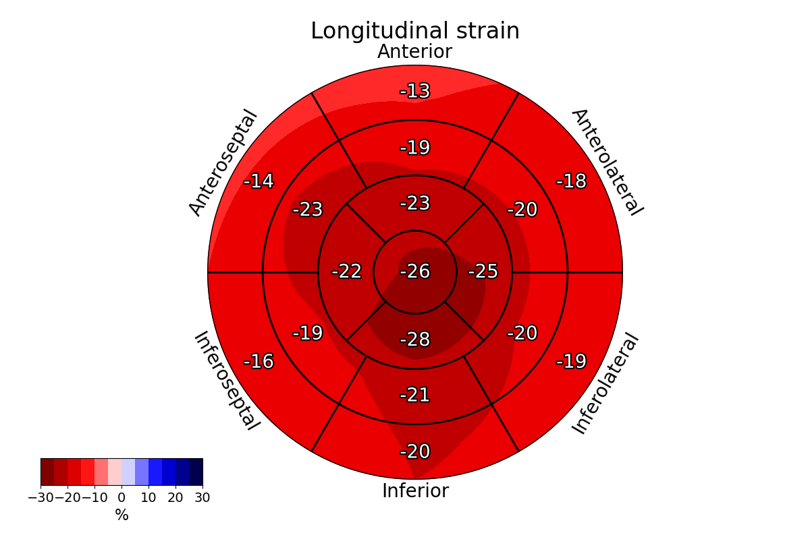

# Smooth 17 and 18 segment AHA bullseye plots
When assessing the function of the left ventricle (LV), American Society of Echocardiography and European Association of 
Cardiovascular Imaging recommends the segmentation of the LV
into 16, 17 or 18 elements. These segmentation schemes result in segments with comparable myocardial mass, which are
also related (with some varibility) to the coronary perfusion. The proposed segmentations enable standardized 
communication within echocardiography and across other imaging modalities. Using novel techonlogies and software, it is 
now possible to calculate the segmental values of the relevant parameters, such as strain or myocardial work.


In this project, the segmental values are visualized using the 17 and 18 segment bullseye plots, to provide insights
into the function of the LV in a palpable way. Proposed plots are smoothed, to increase the readability and enhance the
value of the provided medical data. Examples of strain and myocardial work (with random, probable values) are provided. 
The plots can be generated in two versions: as described in the recommendations, and as provided within the EchoPAC 
software (GE, Horten, Norway).

# Motivation


---
# Screenshots
## 17 AHA plot of Myocardial Work


## Myocardial Work - EchoPAC version


## 17 AHA plot of Segmental Strain


## Segmental Strain - EchoPAC version


---
# How2use

### class

**Call**
```python
```

---
**Input**

---
**Output** 

---
**Methods**


# Credits
Abstract

---
# License
