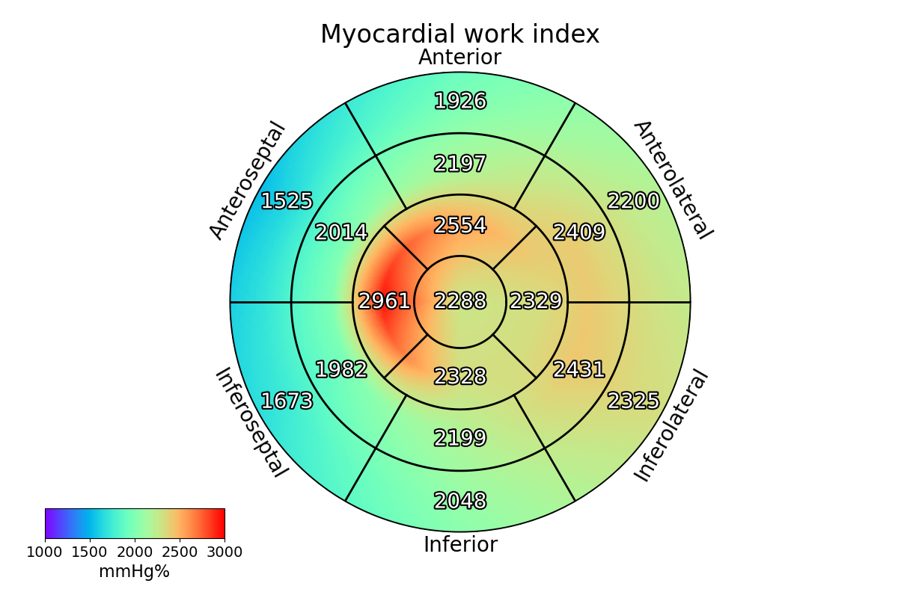
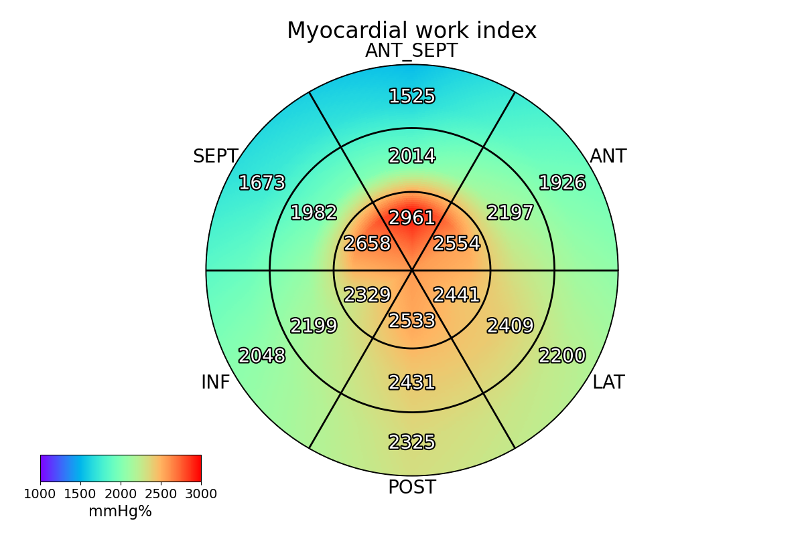
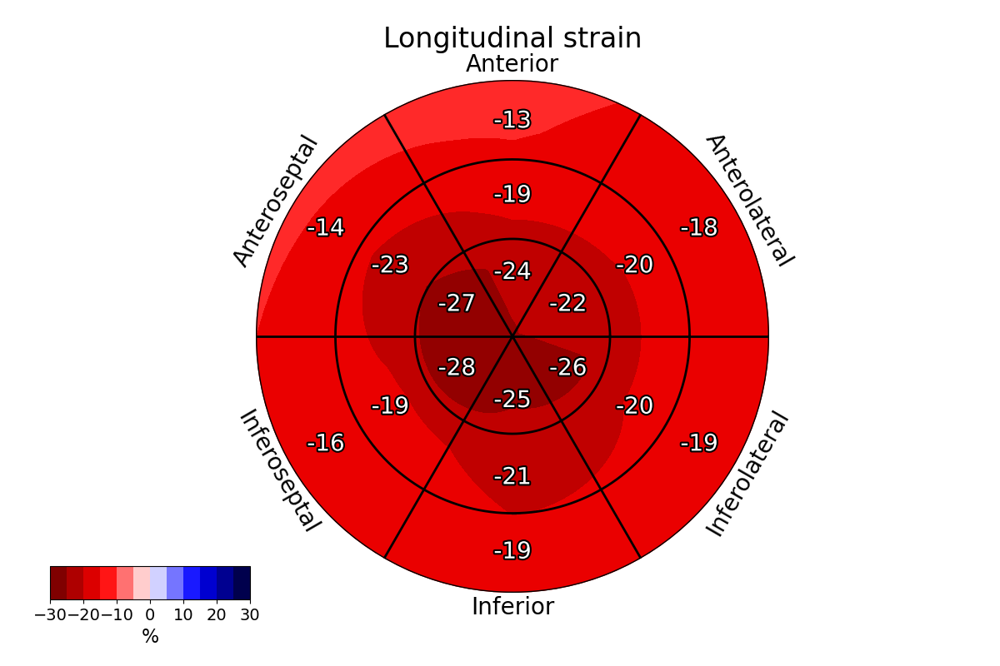
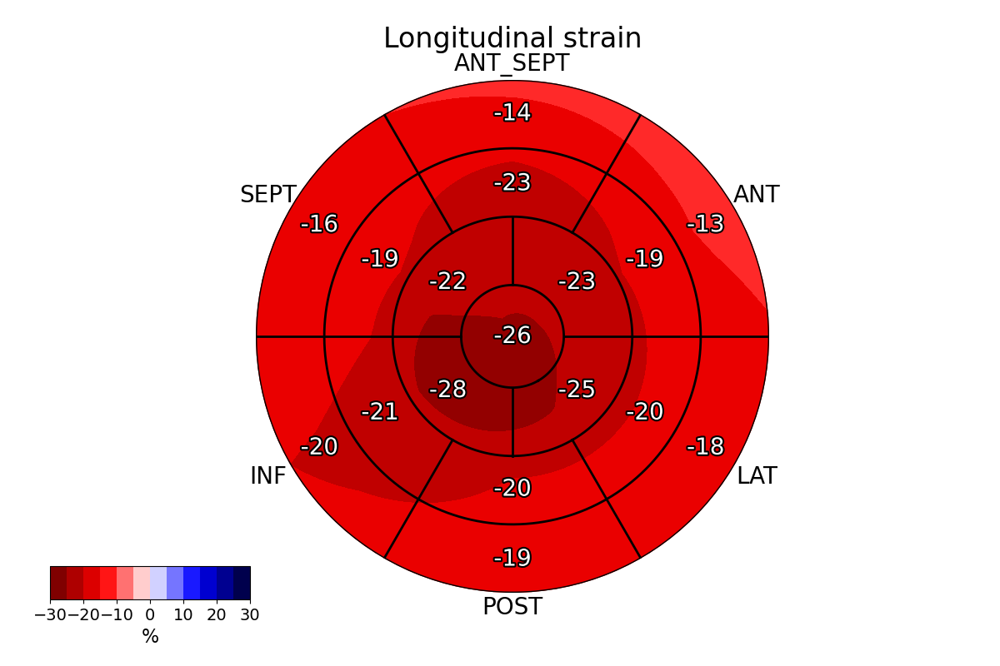

# Smooth 17 and 18 segment AHA bullseye plots
The muscle and cavity of the left ventricle can be divided into a variable number of segments. Based on autopsy data 
the AHA recommends a division into 17 or 18 segments for the regional analysis of left ventricular function or 
myocardial perfusion. These segmentation schemes result in segments with comparable myocardial mass, which are
also related (with some varibility) to the coronary perfusion. The proposed segmentations enable standardized 
communication within echocardiography and across other imaging modalities.

Using novel techonlogies and software, it is now possible to calculate the segmental values of the relevant parameters, 
such as strain or myocardial work. In this project, the segmental values are visualized using the 17 and 18 segment 
bullseye plots, to provide insights into the function of the LV in a palpable way. Proposed plots are smoothed, to 
increase the readability and enhance the value of the provided medical data. Examples of strain and myocardial work 
(with random, probable values) are provided. The plots can be generated in two versions: as described in the 
recommendations, and as provided within the EchoPAC software (GE, Horten, Norway).

# Left Ventricle Segmentation Procedure

When assessing the function of the left ventricle (LV), American Society of Echocardiography and European Association of 
Cardiovascular Imaging recommends the segmentation of the LV into 16, 17 or 18 elements:

* The left ventricle is divided into equal thirds perpendicular to the long axis of the heart. This generates three 
circular sections of the left ventricle named basal, mid-cavity, and apical. Only slices containing myocardium 
in all 360° are included.
* The basal part is divided into six segments of 60° each. The segment nomenclature along the circumference is: 
basal anterior, basal anteroseptal, basal inferoseptal, basal inferior, basal inferolateral, and basal anterolateral. 
The attachment of the right ventricular wall to the left ventricle can be used to identify the septum.
* Similarly the mid-cavity part is divided into six 60° segments called mid anterior, mid anteroseptal, 
mid inferoseptal, mid inferior, mid inferolateral, and mid anterolateral.
* In case of 17 segments:
    * Only four segments of 90° each are used for the apex because of the myocardial tapering. The segment names are 
apical anterior, apical septal, apical inferior, and apical lateral.
    * The apical cap represents the true muscle at the extreme tip of the ventricle where there is no longer cavity present.
 This segment is called the apex.
* In case of 18 segments, the apical part is also divided into six 60° segments called apical anterior, apical 
anteroseptal, apical inferoseptal, apical inferior, apical inferolateral, and apical anterolateral.

---
# Screenshots
## 17 AHA plot of Myocardial Work


## 18 AHA plot of Myocardial Work - EchoPAC version


## 18 AHA plot of Segmental Strain


## 17 AHA plot of Segmental Strain - EchoPAC version


---
# How2use
Two methods creating the most common plots are provided. However, using the basic functions it is possible to generate
different plots, as long as the provided data structure is consistent.

### class

**Call**
```python
# List of segments
segments_18 = ['Basal Anterior', 'Basal Anteroseptal', 'Basal Inferoseptal',
               'Basal Inferior', 'Basal Inferolateral', 'Basal Anterolateral',
               'Mid Anterior', 'Mid Anteroseptal', 'Mid Inferoseptal',
               'Mid Inferior', 'Mid Inferolateral', 'Mid Anterolateral',
               'Apical Anterior', 'Apical Anteroseptal', 'Apical Inferoseptal',
               'Apical Inferior', 'Apical Inferolateral', 'Apical Anterolateral']
# Segmental values
exp_strain_data = [-13, -14, -16, -19, -19, -18, -19, -23, -19, -21, -20, -20, -24, -27, -28, -25, -26, -22]
# Number of segments to plot
n_seg = len(exp_strain_data)

strain_dict = {k: v for (k, v) in zip(segments_18, exp_strain_data)}

from ahasmoothplot import SmoothAHAPlot

# Create object
aha = SmoothAHAPlot(strain_dict, output_path='./images', n_segments=n_seg)
# Plot strain
aha.plot_strain('18_AHA_strain.png', data=strain_dict)
```

---
**Input**

*segments*: dictionary/pandas Series with names of the segments as keys/index and corresponding segmental values

*output_path*: folder where the plots will be saved

*n_segments*: number of segments (must be 17 or 18 and correspond to length of the *segments*)

---
**Methods**
```python
aha.plot_strain(filename='', data=None, echop=False)

```
*filename*: saved figure file name

*data*: dictionary/pandas Series with names of the segments as keys/index and corresponding segmental values

*echop*: whether to use the EchoPAC format of the plot

```python
aha.plot_myocardial_work(filename='', data=None, echop=False)

```
*filename*: saved figure file name

*data*: dictionary/pandas Series with names of the segments as keys/index and corresponding segmental values

*echop*: whether to use the EchoPAC format of the plot

---
# Credits
Acknowledgements to Joao Filipe Fernandes and Fifi Loncaric for their invaluable input. 

---
# License
The code is openly available. If this tool has been useful in your research, please reference this site 
https://github.com/MaciejPMarciniak/smoothAHAplot 
